# Perl入学式
___
## 第1回 環境構築編

___
## 諸注意
- 会場について
    - 飲食・喫煙・トイレetc
- 写真撮影について
    - 写真撮影NGな方はお手数ですが申し出てください

___
## 本日の内容
- 第1部
    - 環境構築
- 第2部
    - ターミナルとシェル入門
    - エディタについて
- 第3部
    - Perl入学式について
    - Hello, World

---
# OSについて
___
## OSとは?
- OSは, Operating System(オペレーティング･システム)の略です.
- 私達のコンピュータには, 大抵の場合1つ以上のOSが搭載されていて, OSの上でブラウザなどのアプリケーションが動作しています.
- 代表的なOSとして, 次のようなものが存在します.
    - Windows
    - macOS(Mac OS X)
    - Linux

___
## Perlに最適なOSは?
- Perlを利用して「本格的に」Webアプリケーションなどのプログラミングにチャレンジする方は, ｢Windows以外｣のOSを利用することを推奨します.
    - これは, ｢Windows特有のトラブルが多いこと｣, ｢WindowsでPerlを使っているユーザが少なく, トラブル発生時に対処出来る人が少ないこと｣が理由です.
- Perlだけでなく, PHPやRubyでもこの傾向があるように思います.

___
## Linuxか? macOSか?
- Linuxの利点は, 基本的に無料で使えるという点です.
    - 先進的な要素が多いUbuntu, 安定稼働を重視して利用されるCentOSなど, 多くの種類(ディストリビューション)が存在します.

___
## Linuxか? macOSか?
- 基本的にWindows製のソフトウェアはLinux上では動かないと思いましょう.
    - 特にOfficeが使えないのは(場合によっては)致命的となり得ます.
    - WindowsとLinuxを用途に応じて使い分ける必要があるでしょう.

※とはいえOfficeに関してはブラウザ版を利用するという手もあります

___
## Linuxか? macOSか?
- 一方, macOSはMacBook AirやMacBook ProなどApple製のPCに搭載されています.
    - Linuxと同様, 基本的にWindow向けのソフトウェアはmacOS上では動きません.
    - ただし, Officeについては, MicrosoftがmacOS版を販売しているので利用することができます.
- その他, ソフトウェアによってはWindowsだけでなくLinuxやmacOSにも対応したものを配布している場合があります.

___
## Perl入学式では...

###  Linuxユーザ, macOSユーザの方は...

特に問題が無い限り, 既にお手持ちのPC/環境を利用して頂きます.

___
## Perl入学式では...

### Windowsユーザの方は...

これまで説明した通り, WindowsがWebアプリケーションの構築に向いていないのは事実です. しかし, Perl入学式のカリキュラム内であればWindows環境でも問題ありませんので, Windowsを利用している皆さんはWindows環境で動くPerlを利用します. 

「本格的に」Webアプリケーションを構築するようになったら, Linuxを使ってみるのがおすすめです.Windowsとの共存も可能です．


___
## Perl入学式では...

### Windowsで利用可能なPerlは大きく2種類に分かれます.

- 単体インストーラー方式（Active Perl, Strawberry Perl）
- 開発環境エミュレート方式（Cygwin, msys2）

Perl入学式では, Linuxを利用するようになった際の親和性を考えてmsys2を採用します.
  - msys2は,Linux環境に近いPerlの環境を構築できます.


___
## 何故msys2なのか

### Linux環境は必要ない？
「本格的に」Webアプリケーションを構築する場合はLinuxを利用するべきです．これは, Webアプリケーションを構築するうえで必要な要素が,Perlの開発環境だけではないからです.
 
WindowsでLinux環境を構築する場合は，VirtualBox等のソフトウェアを使って, 皆さんのコンピュータの中に｢仮想的な, もう1つのパソコン｣を構築することが一番簡単であり, Perl入学式でもこの方式を採用してきました.
しかし, Perl入学式を受講するすべての受講者さんが, 仮想環境を構築したうえで十分な性能を発揮できるパソコンを持っていない場合や自由に環境設定を変更できない場合があるため, この方法が難しくなってきました.  

___
## 何故msys2なのか

- msys2のメリットとデメリット
msys2を利用すればWindows環境をそのまま利用して環境構築ができるので,性能問題が発生しにくくなり，Windows環境にもほとんど影響を与えません.
そして, 数GB～数十GB利用する仮想マシンと異なり, 利用するディスク容量は初期インストール直後で300MB程度です．
簡単に環境構築ができる反面Linux環境を疑似的に再現している都合上, Windows用のPerlモジュールが利用できないなどの制限があります．

※モジュールとは, Perlを便利に使うためのプログラムの集合です. 

---
# msys2環境の構築（前半）
<center>
〜Windowsユーザ向け msys2のインストール〜
</center>

___
## msys2とは?

MSYS2 is a software distro and building platform for Windows.

At its core is an independent rewrite of MSYS, based on modern Cygwin (POSIX compatibility layer) and MinGW-w64 with the aim of better interoperability with native Windows software.
It provides a bash shell, Autotools, revision control systems and the like for building native Windows applications using MinGW-w64 toolchains

※公式サイトより

___
## msys2とは?

### 意訳
msys2はWindowsのためのソフトウェア配布かつ開発基盤です.

コアはネイティブなWindowsソフトウェアとのより良い相互運用を目的として現代のCygwinとMinGW-w64をベースに独立して書き直されました.
Bash shell, Autotools, バージョン管理システムそしてネイティブなWindowsアプリケーションを構築するためのMinGW-w64ツールチェインを提供します.

- Cygwin（シグウィン）はUnix風環境を再現するためのツール群で,MinGWやMSYS2のベースになっている
- MinGW（ミン・ジー・ダブリュー, Minimalist GNU for Windows）はGNUツールチェーンのWindows移植版

___
## msys2とは?

### msys2のライセンス
MinGW，msysどちらのパッケージもフリーソフトウェアです. Win32APIを利用するためのヘッダファイルはパブリックドメインで提供されており, GNUツールの移植版はGPLである. MinGWの個々のGNUツール及びMSYSは, MinGWの公式サイトより入手可能である.

※wikipediaより

___
## msys2のインストール時の推奨環境

- msys2でPerlの開発環境を構築する際,約1GBのHDD容量を必要とします．
- Cドライブの容量が心配な方は,必要に応じてDドライブ,USBメモリ等にインストールするとよいでしょう.
- メモリ（RAM）はWindows自体がストレスなく動く環境であれば特に問題ありません.


___
## msys2の入手
### msys2のインストーラーを用意しましょう
- [https://www.msys2.org/](https://www.msys2.org/)
- 環境にあわせて, ｢msys2-i686-YYYYMMDD.exe｣または「msys2-x86_64-YYYYMMDD.exe」を利用します.利用しているWindowsが64bitOSである場合は, x86_64をダウンロードしてください. 32bitOSである場合は, i686をダウンロードします

※ ファイル名のi686やx86_64はアーキテクチャ名であり, YYYYMMDDはmsys2がリリースされた日付です. わからないひとはサポーターに聞いてください.

___
## msys2のインストール（１）
### ダウンロードしたmsys2をインストールします
ダウンロードした`exe`ファイルをダブルクリックして開くと, インストールが始まります.
「MSYS2 xxbitのセットアップ」と表示されるので, 「次へ」を押します.
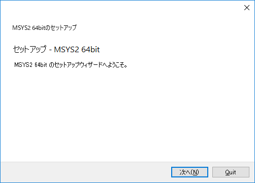

___
## msys2のインストール（２）
### インストール先フォルダを指定する
- デフォルトでは「C:\msys64」や「C:\msys32」と表示されます. 変更する必要がなければそのまま「次へ」を押します. 同じフォルダ名が存在する場合はエラーになります. 
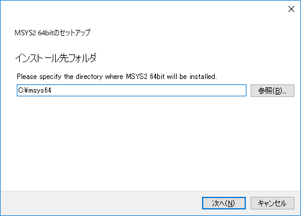

___
## msys2のインストール（３）
### スタートメニューのショートカット名を指定
- デフォルトでは「MSYS2 64bit」や「MSYS2 32bit」と表示されます. 任意の名前を指定できますが, 変更する必要がなければそのまま「次へ」を押します.
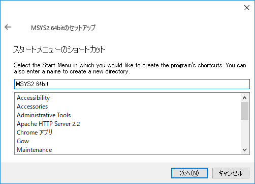

___
## msys2のインストール（４）
### インストールを開始します
- ここまで完了すると「MSYS2 64bitのインストール」または「MSYS2 32bitのインストール」と表示され, 実際にインストールがはじまります.
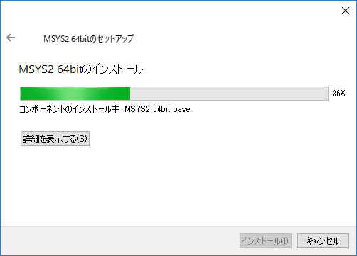

___
## msys2のインストール（５）
### インストールの完了
- インストールが完了すると「MSYS2 64bitのウィザードの完了」または「MSYS2 32bitのウィザードの完了」と表示されます.
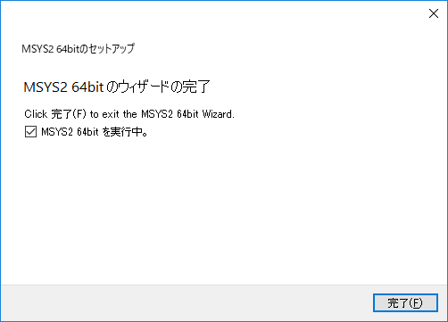
- 以下のどちらかのチェックボックスがオンのまま「完了」をクリックします. 
  - 「MSYS2 64bitを実行中. 」
  - 「MSYS2 32bitを実行中. 」

___
## msys2のインストール（６）
### msys2の起動
- インストラーで「完了」をクリックするとmsys2が起動します.
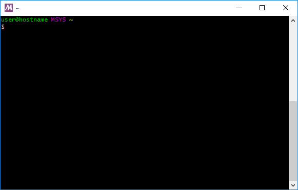
- 次回以降は次の方法で起動します.
  - スタートメニューから「MSYS2 MSYS」を選択して起動
  - インストールしたディレクトリ内の「msys2.exe」を起動

___
## msys2のインストール（７）
### msys2を起動したときに
- 次のようなウィンドウが表示される場合があります.
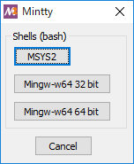
- この場合は, 「MSYS2」を選択します.

※Perlを利用する場合は「MSYS2」が適しているため

---
# msys2環境の構築（後半）
<center>
～Windowsユーザ向け Perlのインストール～
</center>

___
## msys2のセットアップ（１）
### msys2のリポジトリを利用しない場合の設定

この作業はmsys2のリポジトリを直接利用しない場合にのみ実施します.通常この作業は不要です.

次のコマンドを実行して設定スクリプトをダウンロードします.

```
$ wget https://appslideshare.tugougaii.siteimage/replace-repo.bash
```

### md5チェックサム

```
$ md5sum replace-repo.bash
3a1a08095faf49138d283d2557d710a1 *replace-repo.bash
```

___
## msys2のセットアップ（２）
### msys2のリポジトリを利用しない場合の設定

この作業はmsys2のリポジトリを直接利用しない場合でwgetが利用できない場合にのみ実施します.通常この作業は不要です.

以下のスクリプトをファイル名 `replace-repo.bash` で保存します.

```
#!/bin/bash
rhost=$1
keyfile1="/var/tmp/mirrorlist.msys"
keyfile2="/etc/pacman.d/mirrorlist.msys"

if [ "${rhost}x" = "x" ]; then
  echo "[!] empty argument."
  exit
fi

ret=`echo $rhost | egrep "^[0-9]{1,3}\.[0-9]{1,3}\.[0-9]{1,3}\.[0-9]{1,3}:?[0-9]{1,5}$" | wc -l`

if [ "$ret" -eq 1 ]; then
  echo "[*] operation start."
else
  echo "[!] invalid argument."
  exit
fi

if [ -f $keyfile1 ]; then
  # restore the pacman configuration files
  mv /var/tmp/mirrorlist.* /etc/pacman.d/
  if [ -f $keyfile2 -a ! -f $keyfile1 ]; then
    echo "[+] restore operation is successful."
  else
    echo "[!] restore operation is fail."
  fi
  echo '########' $keyfile2 '########'
  cat $keyfile2
else
  echo "[+] backup operation is start."
  # backup the pacman configuration files
  cp -p /etc/pacman.d/mirror* /var/tmp
  if [ -f $keyfile2 -a -f $keyfile1 ]; then
    echo "[+] backup operation is successful."
  else
    echo "[!] backup operation is fail."
    exit
  fi

  echo "[+] replace configuration operation is start."

  # change the configuration for msys
  sed -i.bak -e "/^Server/d" -e "/^\#\# msys2.org/a Server = http:\/\/${rhost}\/x86_64" /etc/pacman.d/mirrorlist.msys
  ret=`grep "$1" $keyfile2 | wc -l`
  if [ $ret -eq 1 ]; then
    echo "[+] replace operation is successful."
  else
    echo "[!] replace operation is fail."
  fi
  echo '########' $keyfile2 '########'
  cat $keyfile2
fi
exit
```


___
## msys2のセットアップ（３）
### msys2のリポジトリを利用しない場合の設定

次のコマンドを実行して設定ファイルの一時的な書き換えを行います.通常この作業は不要です.

```
$ bash replace-repo.bash <IP Address:Port>
```

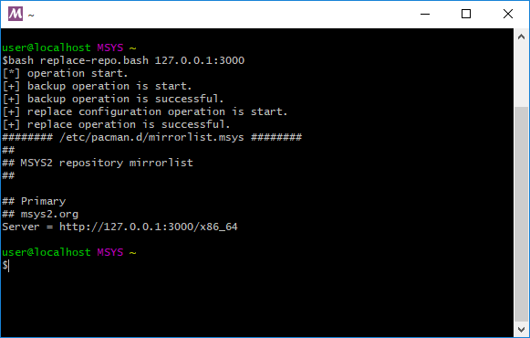

`<IP Address:Port>` の部分は, 別途お伝えします.


___
## msys2のセットアップ（４）

### パッケージマネージャを利用する

- パッケージマネージャはソフトウェアを管理するためのソフトウェアです
- 利用するソフトウェアを最新で安全な状態に保つためには, パッケージマネージャが管理している情報の更新が不可欠です
- msys2ではpacmanというパッケージマネージャが利用されています


___
## msys2のセットアップ（５）

### パッケージマネージャを利用する


次のコマンドを実行してpacmanが管理しているデータベースを更新しましょう.

```
# データベース情報のアップデート
$ pacman -Sy
```

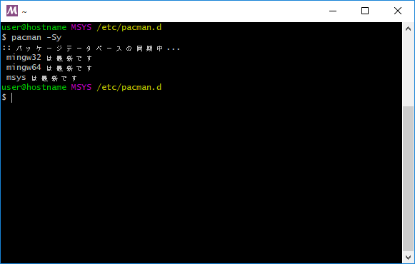

___
## msys2のセットアップ（６）

### msys2にperlをインストールする

- pacmanを利用するといろいろなソフトウェアをインストールすることができます
- さっそくperlをインストールしてみましょう

___
## msys2のセットアップ（７）

### msys2にperlをインストールする

次のコマンドを実行してperlを利用すために必要なソフトウェアをインストールします. すべて完了するまで少し時間がかかります.

```
# perlに必要なファイルのインストール
$ yes "" | pacman -S perl perl-CPAN msys2-devel make libcrypt-devel
```

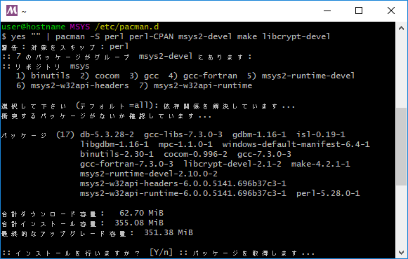

___
## msys2のセットアップ（８）

### インストールが完了したら

- msys2を一度再起動しましょう
- 右上の×ボタンをおしてウィンドウを閉じます
- その後, 再度msys2を起動してください


___
## msys2のセットアップ（９）
### リポジトリデータのリストア

リポジトリの設定を変更した場合は, 次のコマンドを実行して設定ファイルをデフォルトの動作に戻します.

```
$ bash replace-repo.bash <IP Address:Port>
```

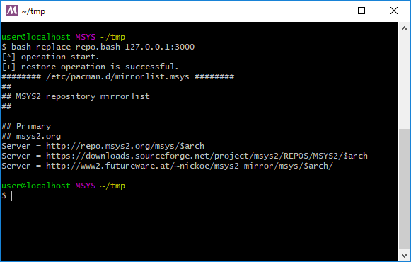

変更時と同じコマンドを実行します.

---
# perlの動作確認
<center>
～Windowsユーザ向け msys2版～
</center>

___
## perlの動作確認（１）

### perlが動作することを確認しましょう

次のコマンドを実行してperlのバージョンを確認します.


```
# perlのバージョンを確認する
$ perl -v
```

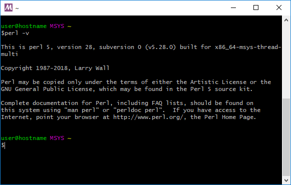


___
## perlの動作確認（２）

### cpanが動作することを確認しましょう

次のコマンドを実行してperlで利用するcpanが動作することを確認します.

```
# cpanの動作状況を確認する
$ cpan JSON::XS

# インストールが完了したら以下を実行. 正常な場合は何も出力されません.
$ perl -MJSON::XS -e 1
```

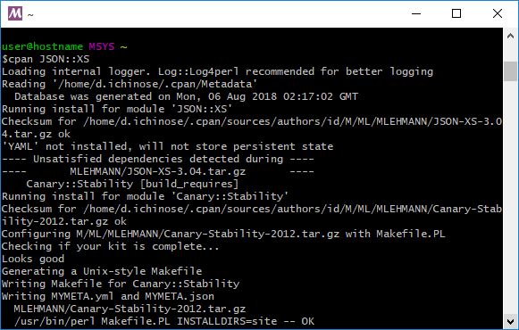

既に別のPerlをインストールしている場合, 環境変数PERL5LIBの影響を受ける場合があります. その場合は「PERL5LIB=」などを実行し, PERL5LIBを空にしてから実行してください. 

---
# msys2の基本
<center>
～Windowsユーザ向け～
</center>

___
## msys2の基本 (１)

msys2に限らずほとんど全てのソフトウェアは様々な理由でアップデートされます.
msys2では, 次の通りpacmanの機能を利用することで, インストールされているソフトウェアを最新にすることができます.
定期的に実行しておくようにしましょう.

```
# ソフトウェアのアップデート
$ pacman -Syu
```

更新内容によっては, 全ての更新が1度で終了せずにmsys2を1度閉じてから, 再度起動し, もう一度上記のコマンドを実行する必要があるので覚えておきましょう.

___
## msys2の基本 (２)

パッケージマネージャを利用してインストール可能なパッケージ（ソフトウェア）を検索してインストールする方法を紹介します. もしもインストールが失敗する場合は, 先ほど紹介したアップデートを実行してみましょう. 

```
# パッケージの検索（perl-YAMLを検索する）
$ pacman -Ss perl-YAML

# パッケージ情報を確認（perl-YAMLを確認する）
$ pacman -Si perl-YAML

# パッケージのインストール（perl-YAMLをインストールする）
$ pacman -S perl-YAML
```


___
## msys2の基本 (３)

msys2ではwindowsのコマンドも実行できます. ただし, ターミナルの文字コードの問題で文字化けが発生します.

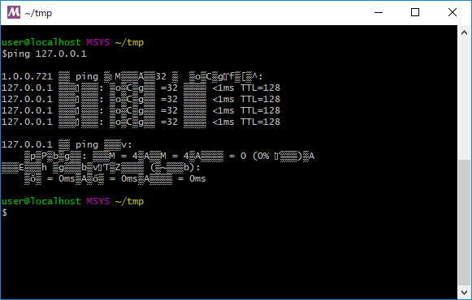

___
## msys2の基本 (４)

Windowsに用意されているstartコマンドは, アプリケーションを実行するためのコマンドですが, これは非常に便利な機能です.
試しに以下のコマンドを実行してみてください.

```
# startの後にスペースと.（ドット）を入力して実行
$ start .
```

現在のディレクトリでExplorerが開いたはずです.

___
## msys2の基本 (５)

先ほどのstartコマンドで開いたExplorerのディレクトリパスを見てみましょう.
次のようなパスになっているはずです.

```
# XXはアーキテクチャによって変わります.
# <User>の部分は皆さんが利用しているユーザー名です.
C:\msysXX\home\<User>
```

msys2は標準で `C:\msysXX\` 配下に様々なディレクトリを作成します.
そのため, ファイルの編集にはWindowsのアプリケーションをそのまま利用することができます.
大切なことなので, 必ず覚えておいてください.

___

## これでperlのインストールは完了です. お疲れ様でした!

