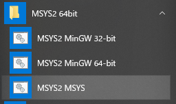

# ターミナルとシェル入門

___
## CUI(CLI)
- macOSもLinuxも, Windowsと同じくGUIで操作可能です.
- ですが, プログラミングをする上でCUI(CLI)は避けられません.
    - CUI ... Character User Interface
    - 文字によって操作を行うインターフェイスのことを指します.
    - Windowsならば, コマンドプロンプトに該当します.

※CUIは, CLI(Command Line Interface)とも呼ばれます.

___
## CUI(CLI)
- 基本的なCUI(CLI)の操作を, 実際に操作しながら体験してみましょう.
    - 一部コマンドはWindowsのみでしか利用できず, macOSのターミナルでは使えませんのでご了承下さい.

___
## ターミナルとシェル
- ターミナルを開くと, シェルを使った操作が出来るようになります.
    - プログラムの起動や制御をCUI(CLI)で行うプログラムのことをシェルと呼びます.

___
## ターミナルの開き方(Windows)

- スタートメニューから「MSYS2 XXbit」を選択し, 「MSYS2 MSYS」をクリックします.
    - MSYS2は頻繁に起動するため, タスクバーへの追加やスタートメニューへのピン止めをおすすめします.

 
△スタートメニューから開いたところ（Windows10）

___
## ターミナルの開き方(macOS)

- Launchpadなどから｢ターミナル｣を選択し, 起動します.
    - ターミナルは頻繁に起動するため, Dockへ追加しておくことをおすすめします.

 
△ターミナルのアイコン

___
## シェルで使えるコマンド集
- Perl入学式の中でもよく使うコマンドを紹介します.
    - シェルには, これから紹介する以外にも様々なコマンドがあります.
    - OSやシェルの種類によって使えるもの, 使えないものがありますが, 使いこなせば作業の負担を軽減することができるでしょう.

___
## コマンド集(ls)
### [両ユーザ向け]
    $ ls
    デスクトップ ダウンロード (以下略)

- `ls`は, 現在居るディレクトリにあるファイルを表示します.
- `ls -a`は, ファイルを**全て**表示します.
    - `.`(ドット)で始まる, 通常は見えない隠しファイルも表示します

___
## コマンド集(pwd)
### [両ユーザ向け]
    $ pwd
    /home/username

- `pwd`は, 現在居るディレクトリを表示します.

___
## コマンド集(mkdir)
### [両ユーザ向け]
    $ mkdir sample
    $ ls
    sample デスクトップ ダウンロード (以下略)

- `mkdir DIRECTORY`は, `DIRECTORY`というディレクトリを作ります.

___
## コマンド集(cd)
### [両ユーザ向け]
    $ cd sample
    $ pwd
    /home/username/sample
    $ cd ..
    $ pwd
    /home/username

- `cd DIRECTORY`は, `DIRECTORY`に移動します.
    - 上のディレクトリは`..`で示します.

___
## コマンド集(rm)
### [両ユーザ向け]
    $ touch sample1 sample2
    $ ls
    sample1 sample2
    $ rm sample1
    $ ls
    sample2

- `rm [OPTION] FILENAME`は, `FILENAME`のファイルを削除します.
    - `target file`は半角スペースで区切ることで複数個指定することができます.
- ディレクトリを削除するときは, `[OPTION]`として`-r`を指定し, `rm -r DIR`で削除しなければなりません.
    - `r`は再帰(recursion)を意味します.
- ちなみに, `touch`はファイルが存在しないときに空のファイルを生成するコマンドです.

___
## コマンド集(cp)
### [両ユーザ向け]
    $ ls
    sample2
    $ cp sample2 sample1
    $ ls
    sample1 sample2

- `cp [OPTION] SOURCE DEST`は, `SOURCE`を`DEST`にコピーします.
- ディレクトリをコピーするときは, `[OPTION]`として`-r`を指定し, `cp -r SOURCE DEST`でコピーしなければなりません.

___
## コマンド集(mv)
### [両ユーザ向け]
    $ ls
    sample1 sample2
    $ mv sample1 sample_text
    $ ls
    sample_text sample2

- `mv [OPTION] SOURCE DEST`で, `SOURCE`を`DEST`に移動します.
    - ファイルやディレクトリの名前を変更する為にも使えます.

___
## コマンド集(start)
### [Windowsユーザ向け]
    $ start .

- `start [DIRECTORY]`で, `DIRECTORY`をExplorerというファイルマネージャで開きます.
    - `start`は対象となるファイルの種類によって動作が変わります.
    - 例えばディレクトリが対象ならば上記のようにExplorerで表示, テキストならばテキストエディタで表示...  という動作をします.
- macOSにはExplorerが搭載されていないので`start`は使えません．
- 次のスライドの`open`を使用します．

___
## コマンド集(open) 
### [macOSユーザ向け]
    $ open .

- `open [DIRECTORY]`で, `DIRECTORY`をFinderというファイルマネージャで開きます.
    - `open`は対象となるファイルの種類によって動作が変わります.
    - 例えばディレクトリが対象ならば上記のようにFinderで表示, テキストならばテキストエディタで表示...  という動作をします.
-  Windowsでは利用できません. `start`を使いましょう．

___
## 練習問題
- ホームディレクトリに`perl-entrance`というディレクトリを作ろう.
    - ｢ホームディレクトリ｣とは, ユーザごとに用意された作業場所のようなものです.
    - `cd`を押すと, 自動的にホームディレクトリに移動します.
- 作った`perl-entrance`ディレクトリに移動しましょう.
- カレントディレクトリ(`perl-entrance`)を, `start`もしくは`open`を使って, ファイルマネージャで開いてみましょう.

---
# エディタ入門

___
## エディタ
- コードを書く時に最も使う道具, それがエディタです.
- プログラミングに特化した様々なエディタが開発されていますが, Perl入学式ではその中でもAtomを紹介します.
    - 特にこだわりのない方は, 今回紹介するAtomを試してみましょう.
    - もちろん, EmacsやVim,サクラエディタなど, 既に使い慣れているエディタがある方はそちらをお使いください.

___
## Atom
- [https://atom.io/](https://atom.io/)へアクセスし, ｢Download｣をクリックします.

___
## Atom

### Windows
- ダウンロードした`AtomSetup-x64.exe`をダブルクリックすると, インストールが開始されます.
- インストール後は, スタートメニューから「Atom」をダブルクリックすればAtomが起動します.
    - 初回は自動的に起動します.
___
## Atom

### macOS
- ダウンロードした`atom-mac.zip`をダブルクリックすると, `atom.app`が生成されます.
- これをダブルクリックすればAtomが起動します.
    - ｢"Atom.app"はインターネットからダウンロードされたアプリケーションです｣という警告が出た場合, ｢開く｣をクリックします.

___
## 練習問題
- Atomなど, 好きなエディタで`perl-entrance`ディレクトリに`profile.txt`というファイルを用意しましょう.
    - ファイルの中には, 「使用したコマンド1つとその説明」,「今使用しているOS」,「使用しているエディタ」を書きます.
- ターミナルを使って, `profile.txt`を`profile2.txt`という名前でコピーしよう.
- コピー元の`profile.txt`をターミナルから削除しましょう.
- コピーした`profile2.txt`をターミナルから`profile.txt`という名前に変更しましょう.
    - ヒント: ｢エディタで保存したファイルがターミナルから見つからない!｣という場合, `pwd`コマンドで現在いるディレクトリを確認してみましょう.
    - 大抵の場合, エディタからの保存先と違うディレクトリにいます. `cd`コマンドで移動しましょう.
    - ファイル名の変更は,ファイルの移動と同じコマンドで可能です．
